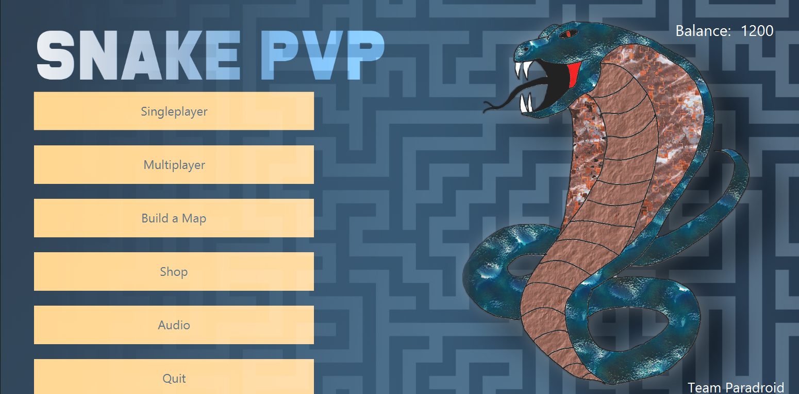
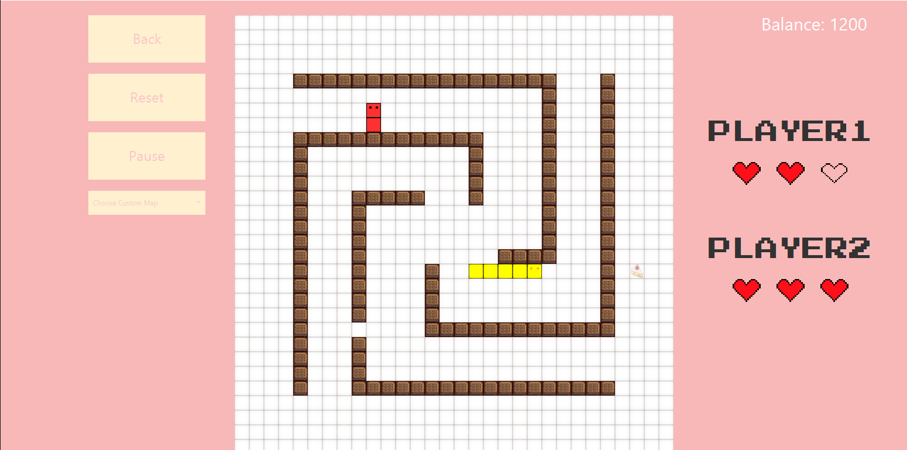
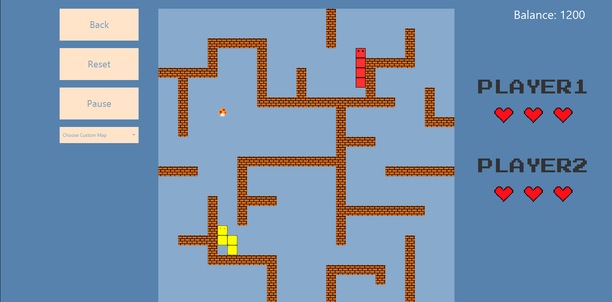
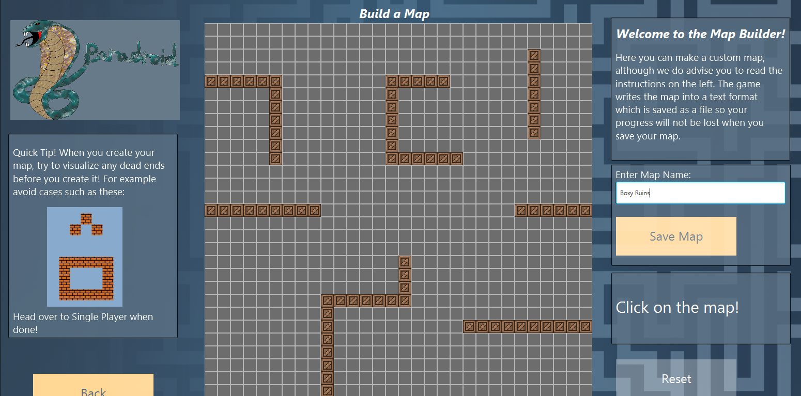
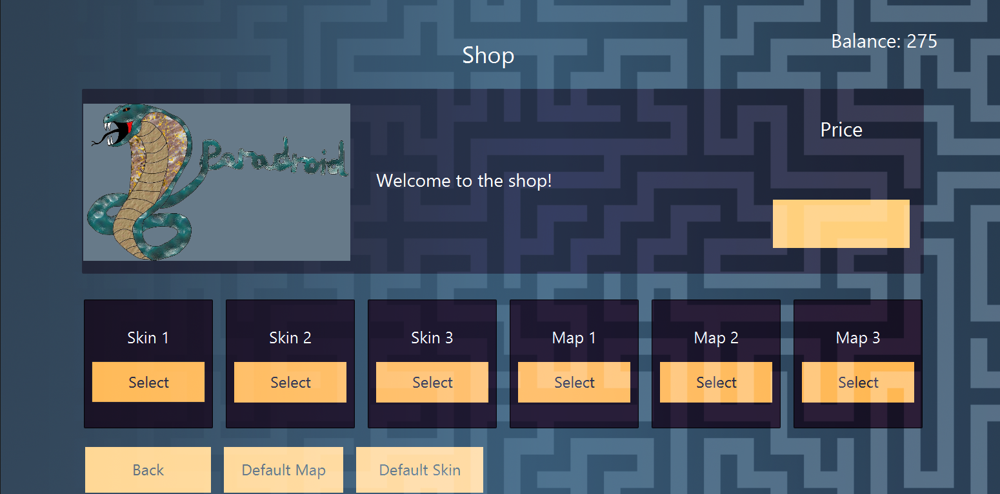

# Team Paradroid
## Snake PVP

## How to run

This game is compiled with Java JDK 1.14, so this is required to run the game.

Currently, the game does not work on Linux, due to issues with creating a run script.

### Windows
From a command prompt, run the script `run.bat` in the root folder.

## Documentation
JavaDoc documentation can be found [here](/doc/index.html) or at `/doc/index.html`

## Screenshots
##### Main Menu

##### Gameplay

#####

##### The Map Builder

##### The Shop

## Produced by
- Daniel Batchford
- Florian-Andrei Blanaru
- Mohammed Jaber Alqasemi
- Dilpreet Kang
- Yuji Fukuta
- Rahul Gheewala

## References
 - [JavaFX](https://openjfx.io/)
 - [JUnit](https://junit.org/junit5/)
 - [JavaDoc](https://docs.oracle.com/javase/8/docs/technotes/tools/windows/javadoc.html)
 - [Pathfinding](https://github.com/danielbatchford/PathFinding)  
    Note that this library was produced previously by a team member (Daniel Batchford), although it was heavily modified to accommodate this project
 - Music / Sound Effects by [Elvira Burlacu](https://www.linkedin.com/in/elvira-burlacu/)  
    - Permission was verbally granted (Daniel Batchford knows Elvira Burlacu)
 - Background image - designed by Daniel Batchford
 - Intro video - designed by Daniel Batchford
    - Apple texture can be found [here](https://www.reddit.com/r/Art/comments/huktuk/apple_me_pixel_art_2020/).
 - Snake and map custom icons - designed by Mohammed Jaber Alqasemi

